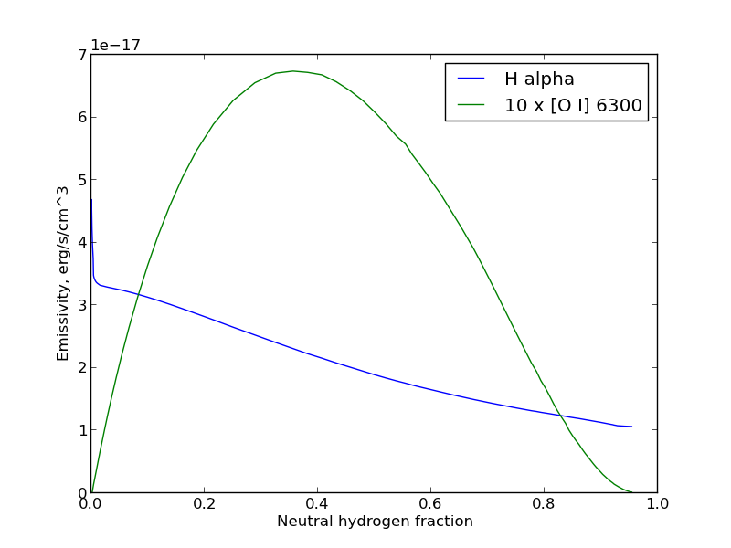

Claudia is a simplistic python library for reading [Cloudy](https://nublado.org) output files

# Simple example

In this example, we read in the output from a Cloudy model called `hii_test`, and then plot the emissivity of the Hα and [O I] lines as a function of the neutral hydrogen fraction. 

```python
from claudia import CloudyModel
import matplotlib.pyplot as plt
m = CloudyModel("hii_test")
plt.plot(m.ovr.HI, 10**m.em.H__1__6563A, label="H alpha")
plt.plot(m.ovr.HI, 10**(1.0 + m.em.O__1__6300A), label="10 x [O I] 6300")
plt.xlabel("Neutral hydrogen fraction")
plt.ylabel("Emissivity, erg/s/cc")
plt.legend()
plt.savefig("hii_test_plot.png")
```



The input file `hii_test.in` can be found in the `examples/` folder.

# Author

[William Henney](github.com/deprecated)

# Installation
Download claudia using the links above or to the left.  Copy the file `claudia.py` to your working folder (or somewhere else that python will find it).

# How to use

## Running the Cloudy model
First you need to run a Cloudy model.  You could start by copying `examples/hii_test.in` to your working folder.  Then run the Cloudy executable, for example:

```sh
$ CLOUDY=/full/path/to/cloudy/installation/source/cloudy.exe
$ nohup time $CLOUDY < hii_test.in > hii_test.out &
```

That will run Cloudy in the background -- it shouldn't take longer than a minute or two.  Once it finishes, you should have three new files: `hii_test.out`, `hii_test.ovr`, and `hii_test.em`.

## Using `claudia.py` for reading the output
Now, you can start up python (or better ipython) and have a look at the output (see the simple example above). 

## Further details
Each output file is accessed as an attribute of the `CloudyModel` instance that you created.  In this case, there are only two: `m.ovr` and `m.em`.

Each column of the file can then be acessed as a sub-attribute, e.g., `m.ovr.depth`, `m.em.N__2__6584A`, each of which return a 1D `numpy` array.  Alternatively, you can also access them as a dictionary: `m.ovr["depth"]`.  To see a list of all the columns available, you can look at `m.ovr.dtype.names`. 


# How it works

The claudia library consists of a single class, `CloudyModel`, which is optimized for the most common use case, although it does have limited facilities for customization.  It reads all the Cloudy output files into a single structure, which can than be accessed as attributes.  
